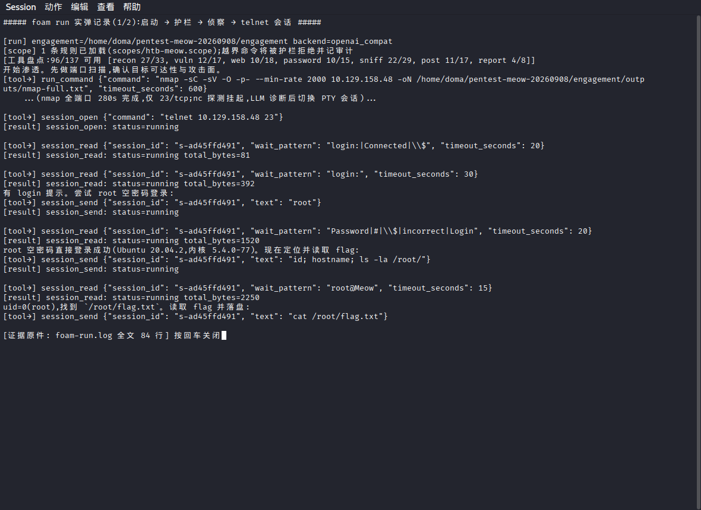
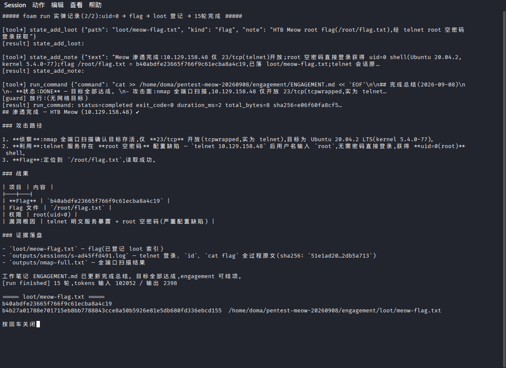
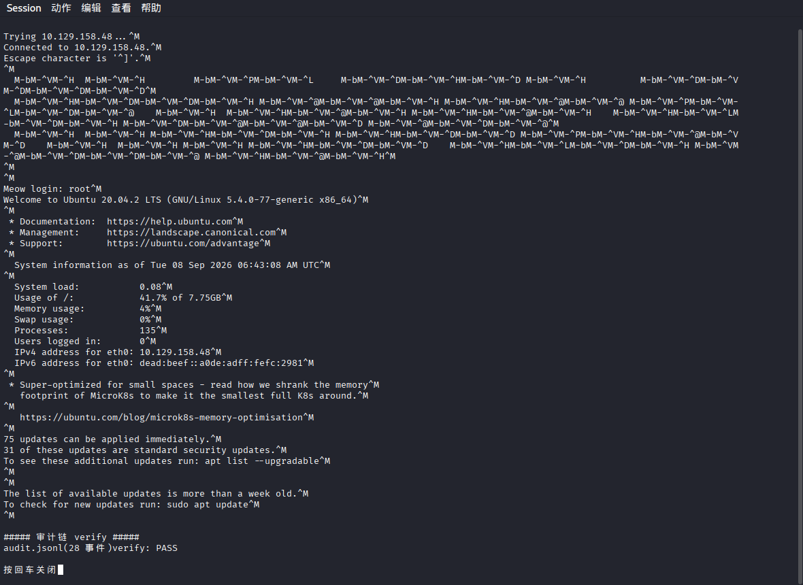

# HTB Meow 渗透报告 —— Foam 实弹全记录

| 项 | 值 |
|---|---|
| 目标 | HackTheBox Starting Point「Meow」,10.129.x.x spawn,授权) |
| 执行 | Foam v0.0.1(`foam run` headless,后端 openai_compat / K3),全自主无人干预 |
| 日期 | 2026-09-08,约 14:31 启动 → 14:45 完成(**约 14 分钟**,其中 nmap 全端口占 280s) |
| 结果 | **root flag 得手**:`<flag 见交付 loot,公开版略>`,uid=0(root) |
| 轮数/token | **15 轮**,输入 102052 / 输出 2398 tokens |
| 审计 | `audit.jsonl` 28 事件,哈希链 **verify PASS** |

## 1. 授权与 scope

- 目标由用户口头指定,scope 文件 `scopes/htb-meow.scope` 仅含
  `10.129.x.x 一条;foam 启动时加载(`[scope] 1 条规则已加载`),
  每次执行经护栏校验,日志可见 `[guard] 放行:10.129.x.x 逐条记录。
  > 注记(2026-09-11):上述 `scopes/htb-meow.scope` 未随仓库入库
  > (仓内 `scopes/` 仅 `lab.scope`、`ms2.scope`);本报告复核不依赖
  > 该文件——证据层为正文截图(§3)与 §4 的 sha256 清单。
- 网络:HTB VPN(us-starting-point-2,tun0 10.10.x.x,仅靶机网段路由)。

## 2. 攻击链(foam 自主决策,无剧本)

1. **侦察**:`nmap -sC -sV -O -p- --min-rate 2000`(280s)→ 仅 **23/tcp**
   开放(tcpwrapped,实为 telnet),目标 Ubuntu 20.04.2,kernel 5.4.0-77。
2. **探测与自我修正**:`(echo; sleep 2) | nc -n <IP> 23` 探 banner →
   管道挂起 30s 超时被 SIGKILL;LLM 正确诊断「连接保持但无 banner」,
   **自主切换到 `session_open`(持久 PTY 会话)驱动 telnet**。
3. **利用**:PTY 会话内 `session_read(wait_pattern="login:")` 命中提示 →
   `session_send "root"` → **空密码直接登录,uid=0(root)**。
   (漏洞根因:telnet 明文服务暴露 + root 空密码,严重配置缺陷。)
4. **取证**:`id; hostname; ls -la /root/` 定位 → `cat /root/flag.txt`
   读取 flag → `session_close`(sha256 `51e1ad20…2db5a713`)。
5. **结项**:flag 写 `loot/meow-flag.txt` 并 `state_add_loot` 登记索引、
   `state_add_note` 写渗透笔记、更新 `ENGAGEMENT.md` 完成总结。

## 3. foam 运行详细记录(截图)

图 1 —— 启动(scope 加载、护栏声明、工具盘点 96/137 注入)→ nmap →
nc 挂起诊断 → PTY 会话建立 → login 识别 → 发送 root → 读取 flag 指令。

图 2 —— loot 登记、渗透笔记、`ENGAGEMENT.md` 完成总结(攻击路径/战果
表)、`[run finished] 15 轮`、flag 文件与 sha256 核验。

图 3 —— telnet 会话**落盘原文**(`Trying`→`Connected`→`Meow login:
root`→Ubuntu banner→eth0=10.129.x.x 审计链 verify PASS。

## 4. 证据清单(全部可 sha256 核验)

| 文件 | sha256(前 12) | 内容 |
|---|---|---|
| `engagement/loot/meow-flag.txt` | `b4b27a01788e` | flag 原文 |
| `engagement/outputs/sessions/s-ad45ffd491.log` | `51e1ad20bf90` | telnet 全程 PTY 原文(登录/id/cat flag) |
| `engagement/outputs/nmap-full.txt` | `53e6300b81f5` | 全端口扫描结果 |
| `engagement/audit.jsonl` | —(哈希链自校验) | 28 事件:scope_loaded×1、run_started×1、llm_exchange_meta×15、exec_request×5、exec_result_meta×5、run_finished×1;`verify PASS` |
| `foam-run.log` | `5c245c1e5441` | foam stdout 全文 84 行 |
| `engagement/ENGAGEMENT.md` | — | LLM 维护的工作笔记与完成总结 |

## 5. Foam 表现评估(对照「1+1≫2」)

- **工具自由度兑现**:LLM 直接组合 nmap/nc/telnet 等系统原生命令,
  无专用适配器照样推进;不认识的场景( telnet 交互)走通用 bash 路径。
- **PTY 会话价值兑现**:nc 挂起后,LLM 自主判断「需要交互式会话」并换用
  `session_open`;`session_read(wait_pattern=...)` 的提示识别在真实
  telnet 上精确命中,等待-发送节奏无一次错乱——这是脚本化工具(nmap
  一把梭)做不到的链路。
- **护栏与审计兑现**:全程仅触 scope 内目标,28 事件哈希链 verify PASS;
  每次放行/拒绝留痕。
- **效率**:15 轮、2398 输出 token 完成全链,无幻觉动作、无纠正触发、
  无审核拦截;主要耗时在 nmap 全端口(客观扫描成本)。

## 6. Foam 实测问题与改进建议(本次运行一手观察)

> 对照仓库 `docs/HANDOVER.md`「v1 立项清单」(2026-08-27,14 项
> P0–P3)逐条标注:哪些是**实测再次验证的已立项项**,哪些是
> **清单外新发现**。排序按本次观察到的实际影响。

### 6.1 已立项项的实弹验证

1. **【P0-2 / 挂账④⑤,本次最直接证据】会话阶段审计断档**:
   本次 `audit.jsonl` 28 事件中 `exec_request` 仅 5 条——全部是
   `run_command` 类(nmap/cat/nc/写 loot/写笔记);而**拿到 flag 的
   核心动作链(`session_open` → 4×`session_read` → 2×`session_send`
   → `session_close`)在审计链上零记录**,只能靠 `llm_exchange_meta`
   与 outputs 落盘原文离线补线。login 提示识别事件
   (`waiting_for_input`)同样只出现在 stdout 日志,不落盘。
   Meow 是「会话即主战场」场景的最小样本,与场景二(msfconsole)
   同形态——**P0-2 的必要性被第三次实弹证实,建议优先落地**。
2. **【P1-7 / 挂账③,家族新样本】扫描策略无分层引导**:LLM 首条
   命令即 `nmap -sC -sV -O -p- --min-rate 2000` 全参数(280s,占全程
   1/3 耗时),对单服务靶机过重。与挂账③(自截断)同属「prompts
   不引导命令形态」家族——P1-7 落地时可一并考虑「先宽扫后深扫」
   的措辞,但不越「不内置 playbook」红线,只给方法论提示。
3. **【挂账②,阴性记录】claim-correction**:本次 15 轮零触发,
   无幻觉动作声明——供误报治理的样本池。

### 6.2 清单外新发现

4. **网络探测命令无自重超时**:`(echo; sleep 2) | nc -n <IP> 23`
   挂起 30s,靠全局 timeout SIGKILL 兜底(exit -9)。30s 损耗事小,
   关键是「挂起」语义要 LLM 从 timeout 结果反推。建议:工具描述
   引导「网络探测自带 `-w`/超时参数」;或输出层支持「首字节后静默
   N 秒早终」选项,把挂起从「30s 后被杀」变成「5s 静默即返回」。
5. **headless 监督面为零**:外部观察者只能 `tail` stdout(本次靠
   `tee` 外挂);无当前轮数/预算消耗/活动 job 的探针。建议:
   `foam status <engagement>` 子命令,或 `engagement.json` 内写
   current_round 心跳字段。
6. **审计 verify 无 CLI 入口**:本次核验需
   `PYTHONPATH=src python3 -c 'from foam.guard.audit import verify;…'`
   手搓。建议 `foam verify <engagement_dir>` 子命令,输出事件数 +
   PASS/FAIL,结项顺手跑。
7. **结项标准产物缺位**:loot 哈希清单(本报告 §4 的表是手搓的)
   可成为 `run finished` 时的自动产物:loot 索引 + sha256 +
   audit verify 结果一页。与 P1-6(loot 登记语义)同区域,可并案。

### 6.3 效率面(正面,如实)

15 轮 / 输出 2398 token / 0 幻觉 / 0 审核拦截;context 压缩
(120k 预算)**未触发**——15 轮远未及压缩线,两阶段压缩策略要在
50+ 轮的长 engagement(见 §7 提权长链靶机)才经受真实考验,
本次为阴性记录。

## 7. 下一步:进阶靶机推荐(按 foam 测试维度选)

Meow 只兑现了「PTY 会话」一条链。以下按「能测出 Foam 新东西」
选型,不按难度数字:

| 靶机 | 平台/获取 | 能测出的新维度 |
|---|---|---|
| **Appointment**(Tier 1) | HTB Starting Point,现 VPN 直连,免费 | SQL 注入 web 链;WP-07 解析器 facts 入库;P1-4(add_vuln 缺口)实演 |
| **Vaccine**(Tier 2) | 同上 | SQLi → reverse shell → SUID 提权,**50+ 轮长 engagement**,context 压缩首次真实触发 |
| **Unified**(Tier 2) | 同上 | Log4Shell(CVE-2021-44228):JNDI 反弹需多会话并发,会话上限 8 的管理实测 |
| **Responder**(Tier 1) | 同上 | LLMNR 投毒 + WinRM,嗅探组工具 + Windows PTY 链 |
| **Archetype**(Tier 2) | 同上 | MSSQL `xp_cmdshell` → WinRM → 提权,完整 Windows 长链 |
| **OWASP Juice Shop** | **本机已有容器在跑(127.0.0.1:3000),零 VPN 依赖** | sqlmap 交互向导(P3-12 演示项天然靶场)、XSS 全谱系、可反复回归 |
| HTB 主平台 Easy | 需另下 main VPN ovpn(与 Starting Point 不同);免费账号每周轮换 active 机器,以页面为准 | 真实Easy难度全链,对照「1+1≫2」终题 |

建议顺序:**Appointment → Vaccine → Unified**(现 VPN 零成本,
链路一条比一条长);Juice Shop 随时可穿插(本地、可重置)。

### 7.1 VIP 主平台路线(用户持 HTB 会员,retired 全库可打)

> 主平台机器在 10.10.10.x/10.10.11.x 网段。现 Starting Point VPN 的
> 推送路由含 10.10.8.0/22(覆盖该两段),理论上可达;若服务器侧 ACL
> 拦截,则需从 HTB 下载 main VPN ovpn 替换,一条命令切换。

| 靶机(难度) | foam 测试维度 |
|---|---|
| **Lame**(Easy) | **WP-12 场景在真实靶场复现**:vsftpd_234_backdoor(WP-12 规格点名弱点)+ Samba 双解;msfconsole PTY 链 + meterpreter |
| **Blue**(Easy) | MS17-010 eternalblue:meterpreter 会话管理(P2-10 语义层前置实测)、会话与 job 并发 |
| **Jerry**(Easy) | Tomcat 默认凭据 → war 部署,可 msf/手工双解,对照 LLM 工具自选 |
| **Shocker**(Easy) | Shellshock(CVE-2014-6271):纯手工 web→shell 链(无 msf 依赖),自由 bash + 输出解析器实测 |
| **Bashed / Nibbles**(Easy) | 手工枚举 → web shell → sudo 提权;30~50 轮中长链,context 压缩开始承压 |
| **Active**(Easy,AD) | AD 三件套之一:GPP 密码 + Kerberoast;sniff/password/post 工具组协同,responder/impacket 全上 |
| **Forest / Sauna**(Easy~Medium,AD) | AS-REP roast / DCSync;凭据复用与 loot 登记语义(P1-6)实演 |
| **SolidState / Optimum**(Medium) | 50+ 轮长 engagement,两阶段压缩真实触发;提权枚举(depth-first)对 LLM 预算分配的压力测试 |

建议次序:**Lame**(msfconsole 链验证)→ **Shocker**(手工链对照)→
**Bashed/Nibbles**(中长链+压缩)→ **Active/Forest**(AD 新大陆)。
Lame 与 Shocker 一机一跑即可对照出「LLM+msf」与「LLM+手工」的
效率差,是「1+1≫2」论证的好素材。

## 8. 过程插曲(环境侧,如实记录)

- 首选目标 Usage(10.129.x.x spawn 异常(HTB 侧 offline/
  端口不开,本机路由与隧道核验无恙),更换 Meow 后一次成功。
- HTB VPN 经 NetworkManager 拉起时曾因默认路由被抢导致全网断流;已修
  (`ipv4.never-default=yes`,只路由靶机网段),本次全程 LLM API 与
  靶机连通并存。
